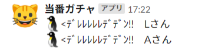

## 当番ガチャ
メンバー表で〇になっているメンバーから、指定した履歴件数分のメンバーを除外した中で、当番を抽選し、Slackに投稿する。

OutgoingWebhookと連携させることで、Slackからトリガーワードで呼び出し可能。

シートに適当なボタンを作成し、dutyGacha関数を紐づけることで、シート上から呼び出しも可能。

### 連携シート
「当番履歴表」という名称の以下のシート  

### 使い方
dutyGacha関数の最初に定義している以下の変数の値を、シートや状況に合わせて指定しておく。

- memberDataCellRange
　メンバー表のデータ部分のセル範囲（デフォルトはA4:B23）

- historyDataColumnRangeStart
　当番履歴表の開始列（デフォルトはD）

- historyDataColumnRangeEnd
　当番履歴表の終了列（デフォルトはF）

- historyDataTargetNum
　過去何件分の履歴をガチャから除外するか（デフォルトは5）

- dutyMemberNum
　当番抽選の人数（デフォルトは2）

### 通知内容

