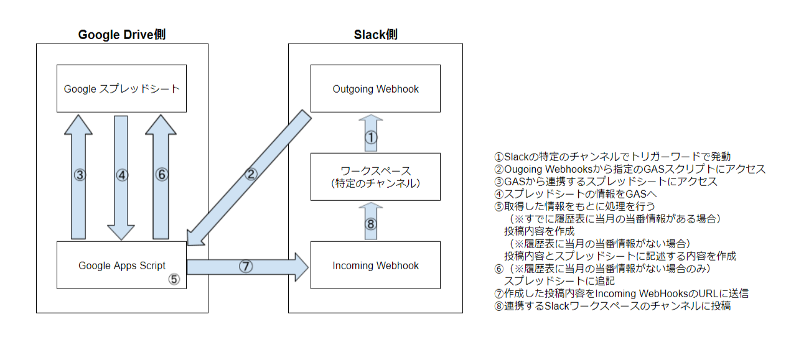

# 当番ガチャ

## 概要
メンバー表で〇になっているメンバーから、指定した履歴件数分のメンバーを除外した中で、当番を抽選し、Slackに投稿する。  
なお、当番履歴表にすでに当月の当番情報がある場合は、その当番情報を投稿する。

Outgoing Webhookと連携させることで、Slackからトリガーワードで呼び出し可能。

シートに適当なボタンを作成し、dutyGacha関数を紐づけることで、シート上から呼び出しも可能。

## 構成図

## 前提と準備
- シートに正しくメンバー表と履歴表があること
- dutyGacha関数の最初に定義している以下の変数の値を、シートや状況に合わせて指定しておくこと
  - memberDataCellRange  
　　メンバー表のデータ部分のセル範囲（デフォルトはA4:C23）
  - historyDataColumnRangeStart  
　　当番履歴表の開始列（デフォルトはE）
  - historyDataColumnRangeEnd  
　　当番履歴表の終了列（デフォルトはG）
  - historyDataTargetNum  
　　過去何件分の履歴をガチャから除外するか（デフォルトは5）
  - dutyMemberNum  
　　抽選する当番の人数（デフォルトは2）
- スクリプトプロパティに以下の値を設定してあること  
 （スクリプトプロパティを使いたくない場合は、値を直接コードに記述する）
  - `WEBHOOK_URL`
  - `SLACK_OUTGOING_TOKEN`

### 連携シート
「当番履歴表」という名称の以下のシート  

## 実行結果
### 通知例
新たにガチャを行った場合

新たにガチャを行わなかった場合  
（すでに当月の当番情報が履歴表にある場合）

### エラー通知例

