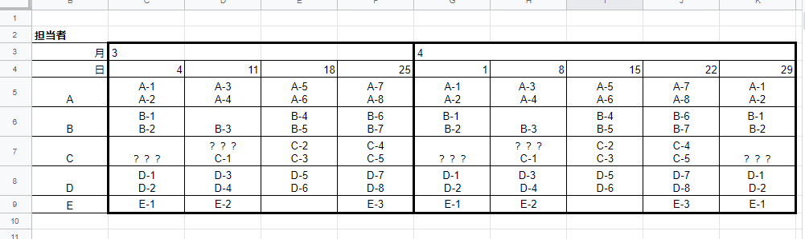
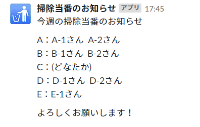
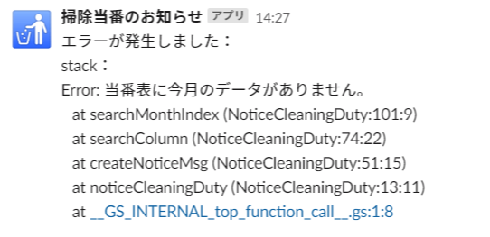

# 掃除当番通知（抽選なし）

## 概要
実行日の日付をもとに、その週の当番の列を特定し当番を通知する。  
なお、毎週月曜日に通知する想定で作成。  

グループ表の内容が不正の場合は例外をスローし、エラー内容を通知する。
また、セルが空白もしくは？？？の場合は「どなたか」と表示する。

## 前提と準備
- シートに正しく今月分の担当データがあること
- スクリプトプロパティに`WEBHOOK_URL`の値を設定していること  
  （スクリプトプロパティを使いたくない場合は、値を直接コードに記述する）

### 連携シート
「掃除当番表・抽選無し」という名称の以下のシート  

### 使用ライブラリ
Underscore：M3i7wmUA_5n0NSEaa6NnNqOBao7QLBR4j

## 実行結果
### 通知例

### エラー通知例

