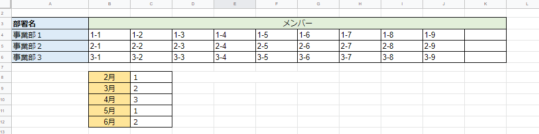
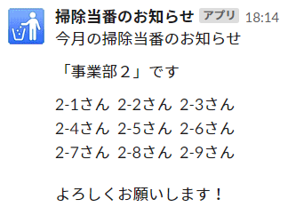
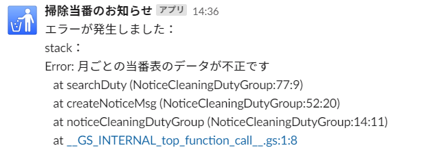

# 掃除当番通知（グループ）

## 概要
実行日の月をもとに、その月の当番のグループを特定しメンバーを通知する。  

グループ表、当番表の内容が不正の場合は例外をスローし、エラー内容を通知する。

## 前提と準備
- シートに正しくグループ表、当番表のデータがある
- スクリプトプロパティに`WEBHOOK_URL`の値を設定していること  
  （スクリプトプロパティを使いたくない場合は、値を直接コードに記述する）

### 連携シート
「グループ表」という名称の以下のシート  

## 実行結果
### 通知例

### エラー通知例
