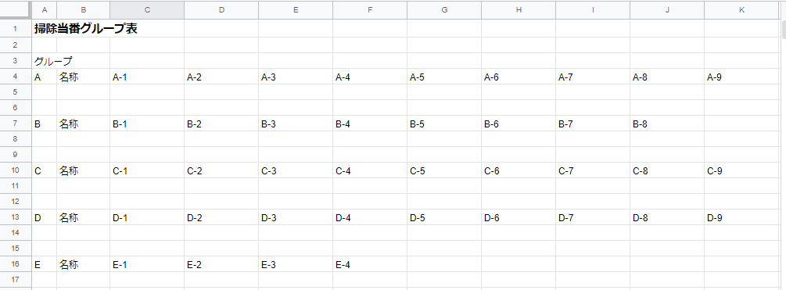
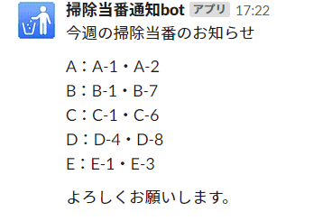
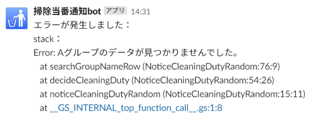

# 掃除当番通知（ランダム）

## 概要
A～Eの各グループ内で、ランダムに掃除当番を決定して通知する。
A～Eのグループのデータがシートにない時は、例外をスロー。

## 前提と準備
- シートに正しくグループ表データがあること
- スクリプトプロパティに`WEBHOOK_URL`の値を設定していること  
  （スクリプトプロパティを使いたくない場合は、値を直接コードに記述する）

### 連携シート
「掃除当番グループ表」という名称の以下のシート  

## 実行結果
### 通知例

### エラー通知例
