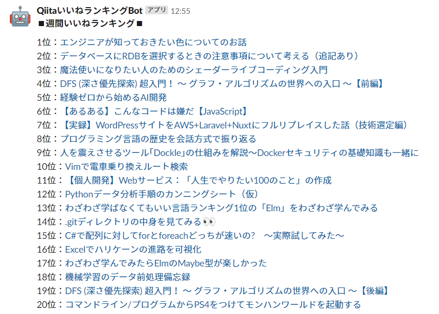

# Qiitaいいねランキング通知Bot

## 概要
Qiitaの週間いいねランキングを通知する。  
GASのトリガー設定で定期実行させることで、通知Botにできる。

Qiitaいいねランキングの取得に関しては、以下のAPIを利用。  
[Qiitaいいね数ランキングAPIの作成](https://qiita.com/zonbitamago/items/1027b532b174e5ee04b3)
- URL：https://us-central1-qiita-trend-web-scraping.cloudfunctions.net/qiitaScraiping/{type}/{YYYY-MM-DD}
  - type：weekly
  - YYYY-MM-DD：実行日の前日

## 前提と準備
- スクリプトプロパティに以下の値を設定していること
  （スクリプトプロパティを使いたくない場合は、値を直接コードに記述する）
  - `WEBHOOK_URL`
  - `QIITA_SCRAIPING_URL`

## 実行結果
### 通知例
上位20の記事が表示される
